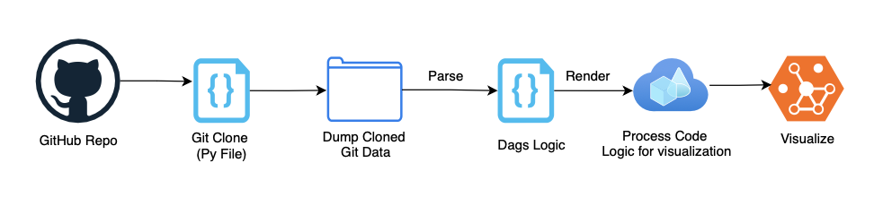
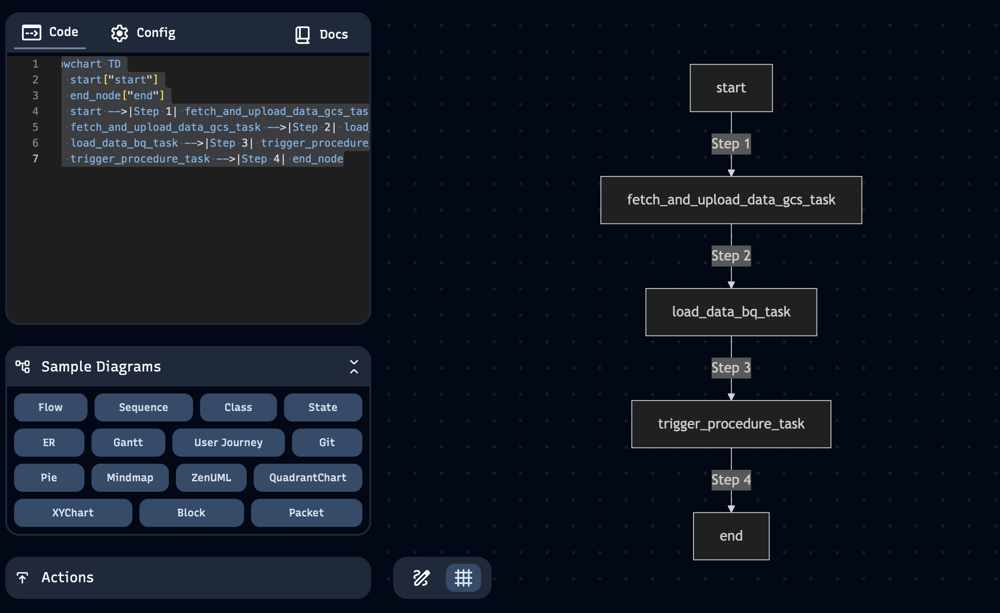

# 🏗️ ArchitectureGen



## Libraries required

```text
ast
os
collections
GitPython - pip3 install GitPython
Streamlit - pip3 install streamlit
```

## 🚀 Steps to Use

### 🔹 Step 1: Clone the Repository

Run the tool with the GitHub repo URL. It will clone the repository into a folder named `cloned_repo`.

#### ✅ Output:

```text
[INFO] Cloning repo from https://github.com/emnikhil/Crypto-Data-Pipeline to cloned_repo...
[INFO] Clone complete.

[INFO] Total Python files found: 1

File: cloned_repo/dag_file/crypto_dag.py
----------------------------------------
from airflow import DAG
from airflow.operators.python_operator import PythonOperator

from google.cloud import bigquery
from google.api_core.exceptions import GoogleAPIError
import logging

from datetime import datetime, timedelta

import time
import requests
import pandas as pd

from google.cloud i...
```

### 🔹 Step 2: Extract DAG Task Functions
The tool scans and indexes all DAGs and function definitions. It then maps each DAG task ID to its corresponding function, showing file path, line number, and full function logic.

#### ✅ Output:

```text
[INFO] Reading all Python files...
[INFO] Indexing all DAG files...
[INFO] Indexing all function definitions...

=========== DAG Task Function Mapping ===========

📄 DAG File: cloned_repo/dag_file/crypto_dag.py
📌 DAGs: []

🔹 Task ID: start
    Function: log_start_time
    File: cloned_repo/dag_file/crypto_dag.py
    Line: 190
    Logic:
def log_start_time():
    print(f'Start time: {datetime.now()}')
------------------------------------------------------------

🔹 Task ID: fetch_and_upload_data_gcs_task
    Function: fetch_and_upload_crypto_data
    File: cloned_repo/dag_file/crypto_dag.py
    Line: 17
    Logic:
def fetch_and_upload_crypto_data():
    url = 'https://api.coingecko.com/api/v3/simple/price'
    ...
    print('Data uploaded to GCS successfully.')
------------------------------------------------------------

🔹 Task ID: load_data_bq_task
    Function: load_data_to_bigquery
    File: cloned_repo/dag_file/crypto_dag.py
    Line: 111
    Logic:
def load_data_to_bigquery():
    ...
    logging.info(f'Data appended to BigQuery table {table_id}.')
------------------------------------------------------------

🔹 Task ID: trigger_procedure_task
    Function: trigger_bigquery_procedure
    File: cloned_repo/dag_file/crypto_dag.py
    Line: 166
    Logic:
def trigger_bigquery_procedure():
    ...
    print('BigQuery procedure executed successfully.')
------------------------------------------------------------

🔹 Task ID: end
    Function: log_end_time
    File: cloned_repo/dag_file/crypto_dag.py
    Line: 194
    Logic:
def log_end_time():
    print(f'End time: {datetime.now()}')
------------------------------------------------------------
```

### 🔹 Step 3: Generate Flow Chart
The tool builds a true DAG flowchart by parsing ```>>, <<, .set_upstream() & .set_downstream() calls```. It also extracts DAG metadata like schedule_interval, start_date, owner, and email, shown above the chart.

#### ✅ Output:

```text
🧩 Mermaid Flowchart:
flowchart TD
    start["start"]
    start --> fetch_and_upload_data_gcs_task["fetch_and_upload_data_gcs_task"]
    fetch_and_upload_data_gcs_task --> load_data_bq_task["load_data_bq_task"]
    load_data_bq_task --> trigger_procedure_task["trigger_procedure_task"]
    trigger_procedure_task --> end_node["end"]
    end_node["end"]
[SAVED] Mermaid chart saved to mermaid_charts/crypto_dag.md
```

🔹 Step 4: Run the Tool via application.py
Use the CLI to analyze the Git Repo Architecture easily.
It will generate clone the Git Repo, extract the files, analyze and generate the flow charts.

```text
python3 -m streamlit run application.py
```


