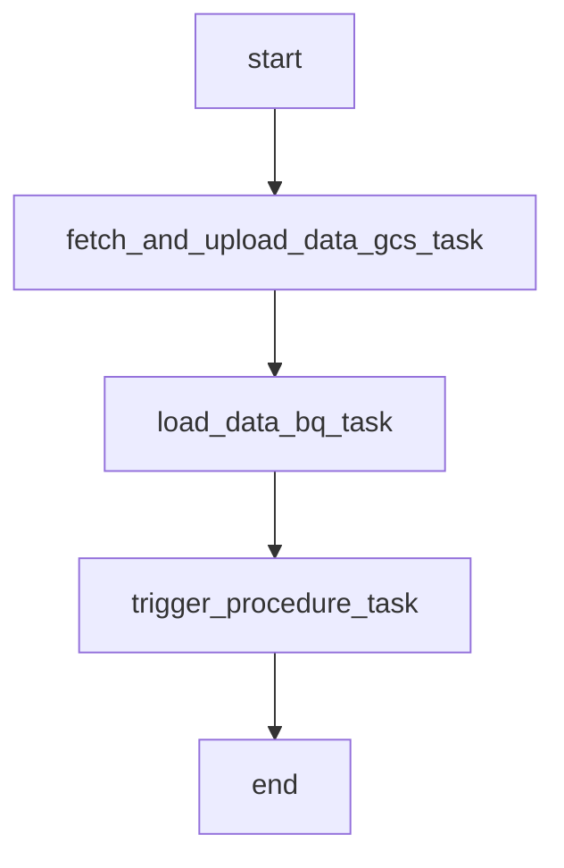

### 📄 DAG File: `cloned_repo/dag_file/crypto_dag.py`
**DAG Name**: `UnnamedDAG`

📌 **DAG Metadata:**
- DAG Name: `UnnamedDAG`
- Schedule: `@daily`
- Start Date: `2024-11-01`
- Owner: `data_engineer`
- Email: `alerts@example.com`

